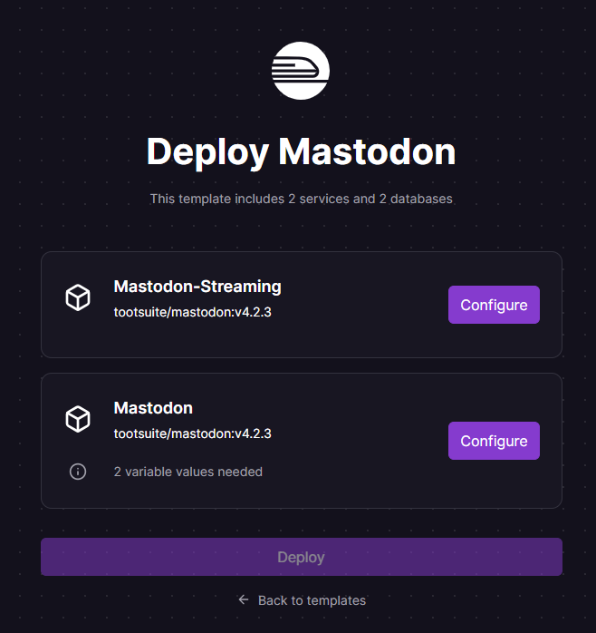
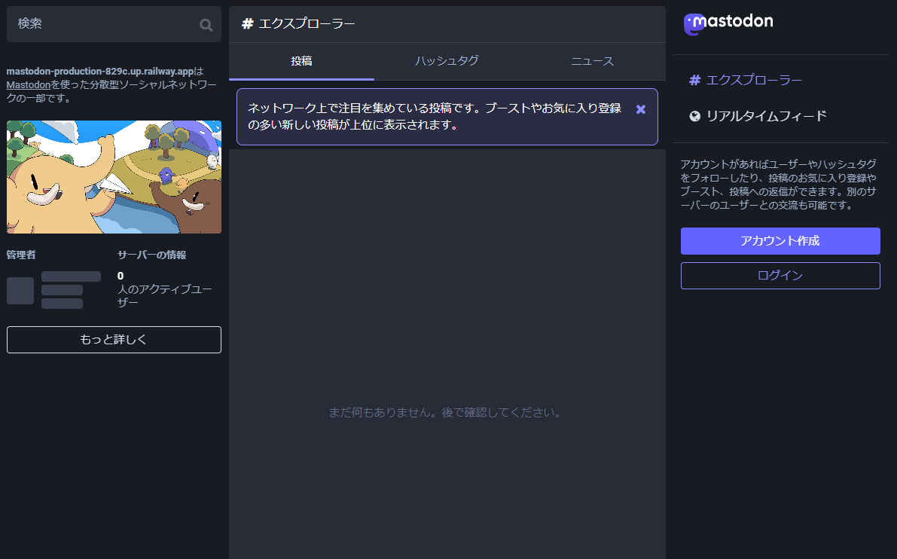

[English](./README.md) | [日本語](./README_ja.md)

# mastodon-railway-template
A template for deploying Mastodon on [Railway](https://railway.app).

## Usage

### 1. Click on "Deploy on Railway"

### 2. Click "Configure" for each service and set the environment variables

You must click "Save Config" for all settings. Below are the instructions for configuring each service.

#### Mastodon-Streaming
No need to edit as it syncs with Mastodon's environment variables.

#### Mailhog
No editing required.

#### Mastodon
| Variable Name | Description | Default |
| --- | --- | --- |
| LOCAL_DOMAIN | Set the domain used for Mastodon. Specify either a custom domain or a free domain available from Railway, like `{any string}.up.railway.app`. | Automatically generated domain |
| SMTP_SERVER SMTP_LOGIN SMTP_PASSWORD SMTP_FROM_ADDRESS | Set these if you want to use a mail server. Mandatory for open servers. For personal use, you can use a tool named Mailhog instead. | Mailhog server |

No other settings need to be edited.

For more details on each setting, refer to the [official documentation](https://docs.joinmastodon.org/admin/config/).

### 3. Click "Deploy" after completing the settings
You can deploy when everything is marked as "Ready to be deployed" as shown in the image below.

### 4. A few minutes later, click on the "Mastodon" service and access the URL
The URL can be found under "Deployments" as shown below.

That's it!

## Account Creation with Mailhog (Single User Mode)
First, open Mailhog. Find the URL under "Deployments."

Then, create an account on Mastodon. Use an email address in the format `{any name}@{Mailhog's domain}`.

After registering, check Mailhog for an email. Authenticate your account through this email.

Once your account is authenticated, enable Single User Mode to prevent others from creating accounts. Go to "Mastodon" -> "Variables," enter SINGLE_USER_MODE, true, and click "Add."

Finally, to prevent others from using Mailhog, make it private by removing the "Public Networking" domain under "Mailhog" -> "Settings" -> "Networking." Hover over the domain to see the trash can icon.

## ⚠️⚠️Caution⚠️⚠️
- Mailhog is used for simplicity, but it is recommended to use a mail service for increased security, especially when used by multiple people.
- Uploaded images are saved on a mounted volume with a capacity of 5GB. It is advisable to set up S3 or similar from the start if needed.
- Railway charges based on usage, so please avoid increasing follows excessively. [You can also set usage limits in the settings.](https://docs.railway.app/reference/usage-limits)
